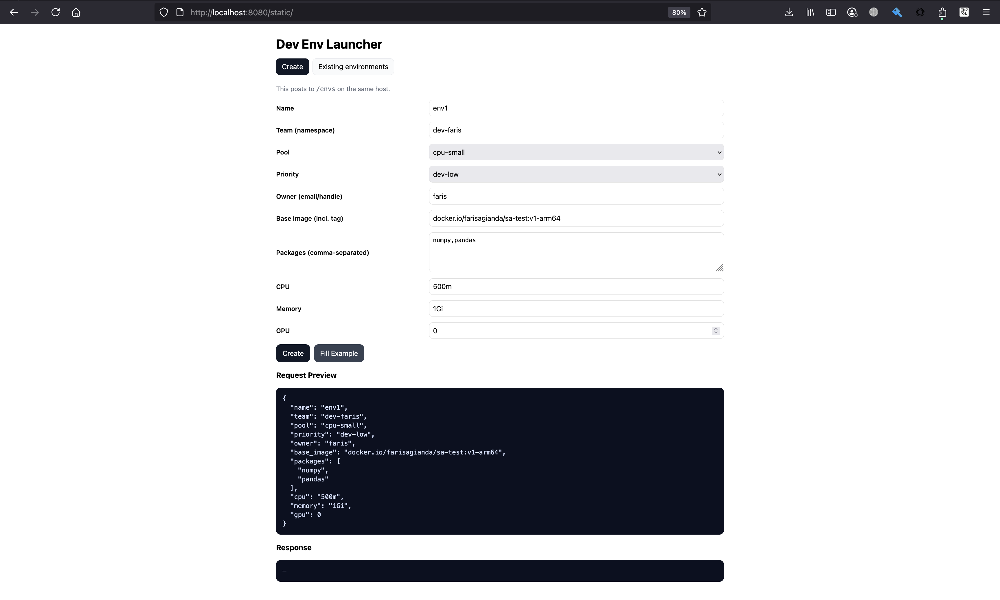
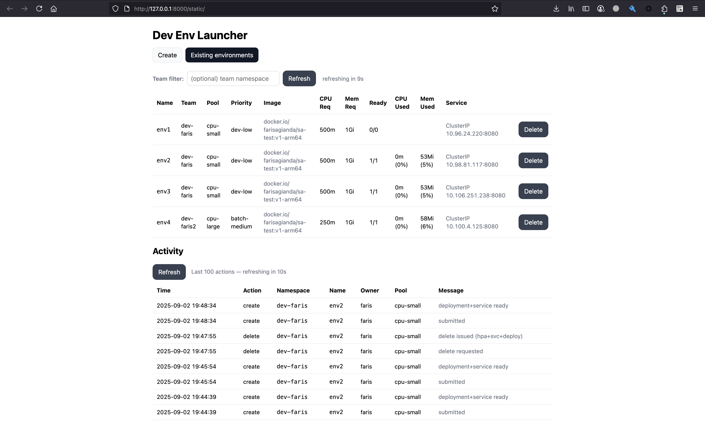
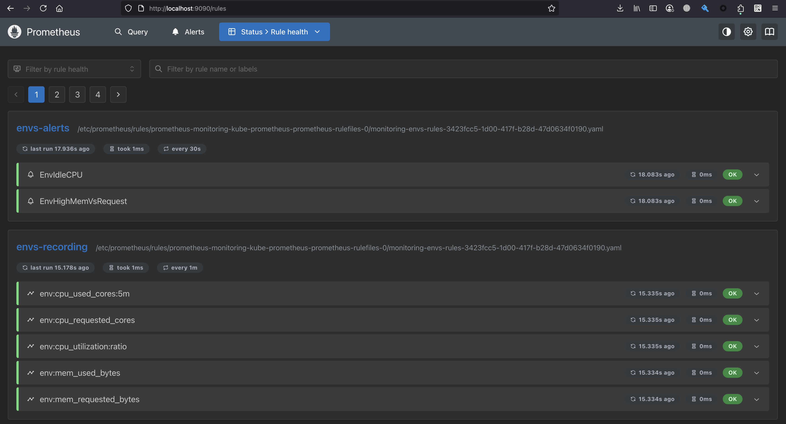
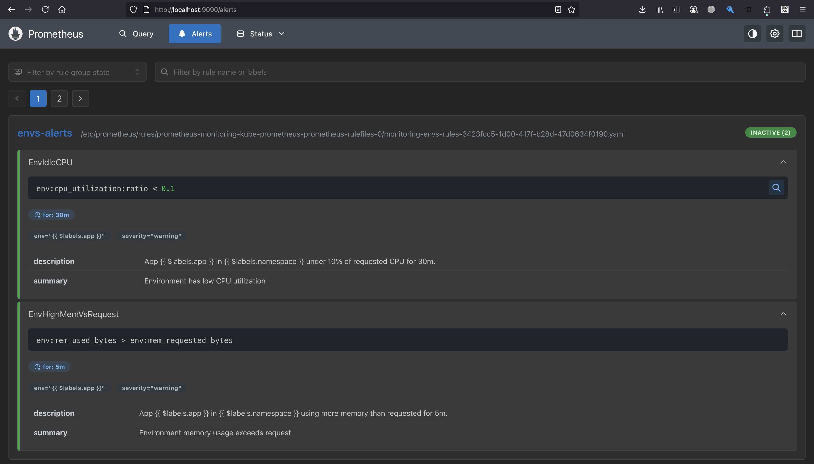
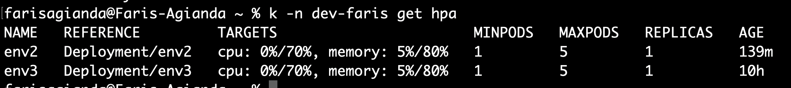

---

# Dev Environments Launcher (Kubernetes)

A **FastAPI** service + **vanilla HTML/JS UI** to let users launch short-lived dev environments with configurable base image, packages, and CPU/memory.

Includes **Prometheus recording/alerting rules** for “requested vs used” metrics, and idle/overuse alerts.

---

### UI – Create Environment


### UI – Existing Environments and Activity Logs (Auto-refreshes every 10s)


---

## Repo layout

```
02-project/
├─ app/
│  ├─ static/                    # UI assets
│  │  ├─ index.html
│  │  └─ app.js
│  ├─ api.py                     # FastAPI endpoints
│  ├─ config.py                  # config/env settings
│  ├─ events.py                  # event/audit logging
│  ├─ k8s.py                     # k8s client ops (deployments, services, HPA)
│  ├─ main.py                    # FastAPI app entrypoint
│  ├─ models.py                  # Pydantic models
│  ├─ payload.json               # example payload
│  ├─ requirements.txt           # fastapi, uvicorn, kubernetes, …
│  └─ Dockerfile                 # dockerfile to build the app
├─ charts/
│  ├─ alertmanager-values.yaml   # values for kube-prometheus-stack helm chart
│  └─ dev-envs/                  # Helm chart for deployment
│     ├─ Chart.yaml
│     ├─ values.yaml
│     └─ templates/
│        ├─ _helpers.tpl
│        ├─ deployment.yaml
│        ├─ namespace.yaml
│        ├─ pdb.yaml
│        ├─ priorityclass.yaml
│        ├─ prometheusrule-envs.yaml
│        ├─ pvc.yaml
│        ├─ rbac.yaml
│        └─ service.yaml
└─ README.md                     # this file
```

---

## 0) Prereqs

* Kubernetes cluster **≥ 1.30** (minikube works fine for local)
* `kubectl` **≥ 1.30**, **Helm v3**
* **Python 3.10+** (if running locally without K8s)

---

## 1) Local app development (without K8s)

```bash
cd 02-project

python -m venv .venv
source .venv/bin/activate
pip install -r app/requirements.txt

# Run the API + UI
uvicorn app.main:app --reload --port 8000

# Open the UI
open http://127.0.0.1:8000/static/
```

By default, the API loads our `~/.kube/config`.
If we want it to actually create Deployments/Services, ensure `kubectl` is pointing to a real cluster or a minikube.

---

## 2) Deploy with Helm

Our CI pipeline builds and pushes the image. To install the chart locally:

```bash
helm upgrade --install dev-envs ./charts/dev-envs \
  -f charts/dev-envs/values.yaml
```

Check rollout:

```bash
kubectl -n dev rollout status deploy/dev-envs-api
```

Access the UI:

```bash
kubectl -n dev port-forward svc/dev-envs-api 8080:80
open http://127.0.0.1:8080/static/
```

---

## 3) Monitoring (Prometheus/Grafana)

### 3.1 Install kube-prometheus-stack

```bash
helm repo add prometheus-community https://prometheus-community.github.io/helm-charts
helm repo update

helm upgrade --install monitoring prometheus-community/kube-prometheus-stack \
  -n monitoring --create-namespace \
  -f charts/dev-envs/alertmanager-values.yaml
```

### 3.2 Apply PrometheusRule via App Helm Chart

```bash
helm upgrade --install dev-envs ./charts/dev-envs \
  -f charts/dev-envs/values.yaml
```
Make sure the values.yaml has these in it
```commandline
prometheusRule:
  enabled: true
  namespace: monitoring
```

Rules created:

* `env:cpu_requested_cores`
* `env:mem_requested_bytes`
* `env:mem_used_bytes`
* `env:cpu_utilization:ratio`


*Shows custom recording rules (`env:*`) and alerts (`EnvIdleCPU`, `EnvHighMemVsRequest`) loaded into Prometheus.*

Alerts:

* `EnvIdleCPU` – CPU < 10% of request for 30m
* `EnvHighMemVsRequest` – memory usage > request for 5m


*Example of alerts being evaluated (inactive/active states).*

### 3.3 Grafana access

```bash
kubectl -n monitoring get secret monitoring-grafana \
  -o jsonpath='{.data.admin-password}' | base64 -d; echo

kubectl -n monitoring port-forward svc/monitoring-grafana 3000:80
open http://127.0.0.1:3000
# user: admin, pass: <from above>
```

Explore with queries:

```promql
env:cpu_utilization:ratio{namespace="dev"}
env:mem_used_bytes{namespace="dev"}
```

---

### Testing Alerts (Locally)

We can simulate an alert firing and hitting the app’s `/alerts` webhook:

1. **Port-forward** the API service:

   ```bash
   kubectl -n dev port-forward svc/dev-envs-api 8080:80
   ```

2. **Send test payload**:

   ```bash
   curl -sS -H 'Content-Type: application/json' \
     --data @payload.json \
     http://0.0.0.0:8080/alerts
   ```

This will trigger the app’s webhook logic (e.g., scaling down an environment if `EnvIdleCPU` fires). `payload.json` file is under app folder.

---

## 4) API quick reference

* `POST /envs` — create an environment
* `GET /envs?team=<ns>` — list environments
* `DELETE /envs/{team}/{name}` — delete env
* `GET /events` — recent in-memory event log
* `GET /audit` — audit log from PVC
* `POST /alerts` — trigger a scale down from EnvIdleCPU alert

UI is served at `/static/`. Again, can be accessed via port-forward
```bash
kubectl -n dev port-forward svc/dev-envs-api 8080:80
open http://127.0.0.1:8080/static/
```

---

## 5) Cluster autoscaling & resource pools

Requirement #3 was:

> The cluster needs to automatically handle up/down scaling and have multiple instance groups/taints/tags/others to be chosen from in order to segregate resources usage between teams/resources/projects/others.

### Local (minikube)

Minikube does not support true cluster autoscaling — there’s no cloud API to add/remove nodes automatically. We can only:

* Manually add/remove nodes:

  ```bash
  minikube node add
  minikube node delete
  ```
* Or run HPAs (HorizontalPodAutoscalers) inside minikube, which only scale *pods*, not nodes.

This is why the HPA examples below show pods scaling up/down based on CPU/memory usage, but the cluster itself stays fixed.


*Shows HorizontalPodAutoscaler tracking CPU/memory utilization for each environment deployment.*

### Cloud (EKS + Karpenter, AWS)

In a real cluster (e.g. Amazon EKS), We can enable **Karpenter** for cluster autoscaling.

* Karpenter watches for **pending pods** that can’t be scheduled.
* It provisions EC2 instances that match the pod’s labels/taints/requests.
* When nodes go empty or underutilized, Karpenter consolidates and terminates them.

Our app already sets:

* `nodeSelector: { pool: cpu-small|cpu-large|gpu-a100 }`
* tolerations for `pool=…`
* optional `priorityClassName`

We’d create **Karpenter NodePools** that advertise those same `pool` labels. Example:

```yaml
apiVersion: karpenter.sh/v1beta1
kind: NodePool
metadata:
  name: cpu-small
spec:
  template:
    metadata:
      labels:
        pool: cpu-small   # <— matches our pod nodeSelector
    spec:
      nodeClassRef:
        name: cpu-small-class
      requirements:
        - key: "node.kubernetes.io/instance-type"
          operator: In
          values: ["t3.large","m6i.large"]
  disruption:
    consolidateAfter: 5m
```

With this:

1. User creates an environment with `pool=cpu-small`.
2. If no node matches, Karpenter provisions an EC2 instance with that label.
3. When workloads scale down or go idle, Karpenter consolidates and removes unused nodes.

👉 This is how “multiple instance groups/taints/tags” (requirement #3) map directly to our existing `pool` and `priority` fields.

---

## 6) DNS & SSH/SFTP Access

Requirement #4 was:

> SFTP, SSH or similar access to the deployed environment is needed so DNS handling automation is required.

### 6.1 DNS Handling Automation

For DNS automation we use **[external-dns](https://github.com/kubernetes-sigs/external-dns)**.
It watches Kubernetes resources (Ingresses, Services, VirtualServices, etc.) and automatically creates/updates DNS records in Route53.

We can install it with Helm:

```bash
helm repo add external-dns https://kubernetes-sigs.github.io/external-dns/
helm repo update

helm upgrade --install external-dns external-dns/external-dns \
  -n kube-system \
  --set provider=aws \
  --set registry=txt \
  --set txtOwnerId=dev-envs \
  --set serviceAccount.annotations."eks\.amazonaws\.com/role-arn"=arn:aws:iam::<ACCOUNT_ID>:role/external-dns-role
```

This requires an IAM role (`external-dns-role`) with Route53 permissions (e.g. `route53:ChangeResourceRecordSets`, `route53:ListHostedZones`).

---

### 6.2 SSH and SFTP Access

For cluster nodes (EKS worker nodes), we can enable access in two main ways:

**a) SSH via EC2 Key Pair (Launch Template)**
When creating the EKS managed node group, we attach a launch template that includes our SSH key:

```hcl
resource "aws_launch_template" "eks_nodes" {
  name_prefix   = "eks-nodes"
  image_id      = "ami-xxxxxxxx"
  instance_type = "t3.large"
  key_name      = "our-eks-key"    # <— EC2 key pair for SSH
  vpc_security_group_ids = [aws_security_group.eks_nodes.id]

  tag_specifications {
    resource_type = "instance"
    tags = {
      Name = "eks-node"
    }
  }
}
```

Then we create the node group with this launch template so we can SSH into nodes with our key.

**b) Session Manager (SSM) Access**
Instead of SSH keys, we can enable **AWS Systems Manager (SSM)**:

1. Attach the managed policy `AmazonSSMManagedInstanceCore` to our node IAM role.
2. Ensure outbound internet or VPC endpoints for SSM.
3. Connect without SSH keys:

```bash
aws ssm start-session --target <INSTANCE_ID>
```

This gives us shell access to nodes without managing SSH keys.
For SFTP, we can either use the same channel (port forwarding via SSM) or deploy AWS Transfer Family if we need a managed SFTP service backed by S3/EFS.

---

👉 With this setup:

* **ExternalDNS** handles DNS automation for our services.
* **SSH/SFTP access** is enabled either via EC2 key pairs or via SSM for keyless secure access.

---

## 7) Clean up

```bash
helm uninstall dev-envs
helm -n monitoring uninstall monitoring
```

---